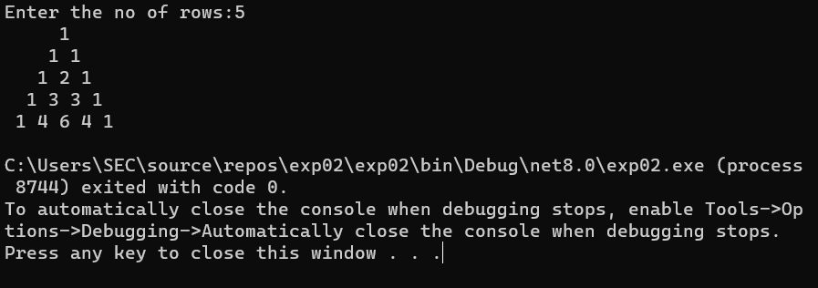

# Exp02-CSharpPattern

## Aim:
 To write the C# program to print Pascal's triangle.

## Algorithm:

### Step1:
Initialize the neccessary attributes.
### Step2:
Get the no. of rows from the user.
### Step3:
Using for loop print the rows, columns and spaces at required places.
### Step4:
Apply if condition to print 1.
### Step5:
If the condition fails, print the number using the formula.
        value=value*(i-j+1)/j.
## Program:
```
using System;
public class Pattern
{
    public static void Main()
    {
        int rows,c=1,a,i,j;
        Console.Write("Enter the no of rows:");
        rows=Convert.ToInt32(Console.ReadLine());
        for(i=0;i<rows;i++)
        {
            for(n=1;n<=rows-i;n++)
            {
                Console.Write(" ");
            }
            for(j=0;j<=i;j++)
            {
                if(i==0||j==0)
                {
                    c=1;
                }
                else
                {
                    c=c*(i-j+1)/j;
                }
                Console.Write("{0} ",c);
            }
            Console.Write("\n");
        }
    }
}
```

## Output:


## Result:
Hence, a C# program for a pascal's triangle is executed successfully.